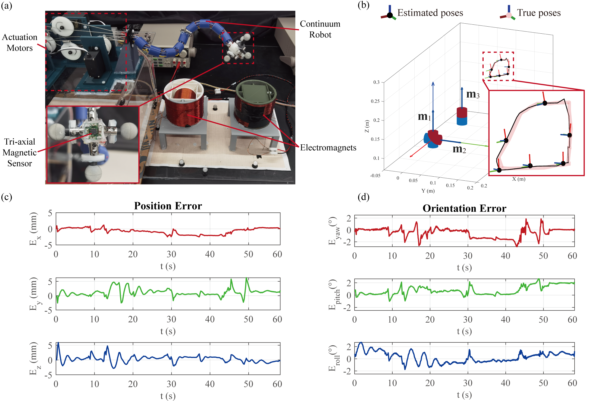

# On Ambiguity in 6-DoF Magnetic Pose Estimation 
***Under review***

[Click here to preview the first two pages of the manuscript]([Ambiguity][p1-2]Xinlei.pdf)

<figure markdown>
  { width="600" }
  <figcaption>Schematic of magnetic pose estimation using stationary magnetic source(s) and a tri-axial magnetic sensor for localization of a flexible robotic endoscope</figcaption>
</figure>  

<figure markdown>
  { width="600" }
  <figcaption>Experiment on tip pose tracking of a continuum robot. (a) Experimental setup. (b) Tip pose tracking results with true and estimated trajectories. (c) Position error plot. (d) Orientation error plot.</figcaption>
</figure>  
